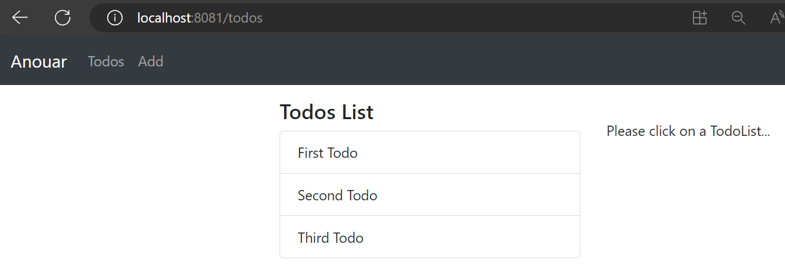
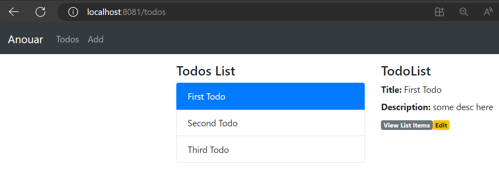

# React.js TodoList CRUD App with React Router & Axios

Build a React.js Todo List CRUD Application to consume Web API, display and modify data with Router, Axios & Bootstrap.

React TodoList Application in that:
- Each TodoList has title, description.
- We can create, retrieve, update, delete Todos.
- We can retrieve, update, delete TodoList items.





### Set port
.env
```
PORT=8081
```

## Project setup

In the project directory, you can run:

```
npm install
# or
yarn install
```

or

### Compiles and hot-reloads for development

```
npm start
# or
yarn start
```

Open [http://localhost:8081](http://localhost:8081) to view it in the browser.

The page will reload if you make edits.
